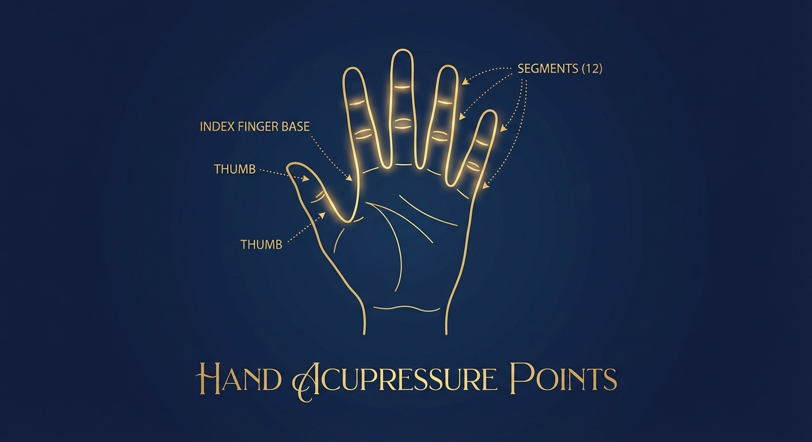
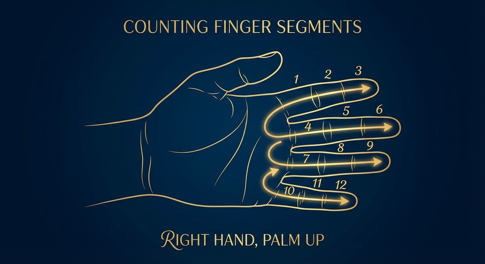

# The Pilgrim's Hands: A Guide to Dozenal Knuckle-Counting

*How our ancestors counted to twelve on one hand — and why you should too*

---

## Introduction

Long before calculators, long before written numerals, humans counted on their fingers. But while most modern cultures count to ten (using each finger as one unit), ancient traders and scholars discovered something better: **counting to twelve on a single hand**.

This technique — counting the finger segments (phalanges) with your thumb — has been used for thousands of years across Mesopotamia, Egypt, India, and beyond. It's likely why we have:

- 10z/12d hours on a clock face
- 10z/12d months in a year  
- 10z/12d inches in a foot
- 50z/60d seconds in a minute (10z × 5z)

The ancients knew what the decimal world has forgotten: **Twelve is the natural number for counting.**

---

## The Basic Technique

### Your Hand is a Dozenal Calculator

Look at your right hand (or left, if you prefer). Notice that each finger has **three segments** — the phalanges separated by your knuckle joints:

| Finger | Segments |
|--------|----------|
| Index | 3z/3d |
| Middle | 3z/3d |
| Ring | 3z/3d |
| Pinky | 3z/3d |
| **Total** | **10z/12d** |

Your thumb becomes the **pointer** — touching each segment as you count.

### How to Count

**Step 1:** Hold your right hand open, palm facing you.

**Step 2:** Use your thumb tip to touch each segment, starting with the **base of your index finger** (closest to your palm).

**Step 3:** Count upward on each finger:
- Index finger: 1z, 2z, 3z (base to tip)
- Middle finger: 4z, 5z, 6z
- Ring finger: 7z, 8z, 9z  
- Pinky: ↊z (dek), ↋z (el), 10z (dozen)

**That's it!** You've just counted to a dozen on one hand.

---

## The Historical Journey

### Mesopotamia: Where It Began

The Sumerians and Babylonians (circa 3000 BCE) used a base-60 number system — and base-60 is intimately connected to twelve. Scholars believe they counted 10z/12d on one hand and tracked groups of dozens (up to 5z/5d) on the other hand:

10z × 5z = 50z (that's 12d × 5d = 60d)

This is why we have 50z/60d minutes in an hour and 50z/60d seconds in a minute. The Babylonians were dozenal thinkers!

### Egypt: The Merchant's Count

Egyptian traders adopted knuckle-counting for commerce. When you're bargaining in a busy marketplace, being able to count to 10z/12d on one hand (while holding goods in the other) is invaluable.

### India and the Islamic World

The technique spread along trade routes. In parts of India, Pakistan, and the Middle East, knuckle-counting is **still practiced today** — particularly among merchants in traditional bazaars.

### East Asia: A Parallel Discovery

Chinese and Japanese counting traditions also recognized the utility of twelve. The Chinese zodiac has 10z/12d animals. The traditional Japanese counting system includes dozenal elements.

---

## Advanced Technique: Counting to a Gross

Want to count higher? Use **both hands**:

- **Right hand:** Counts 1z to 10z (1d to 12d) on finger segments
- **Left hand:** Tracks completed dozens on its segments

When your right hand completes a full dozen, touch the first segment of your left index finger. Continue counting on your right hand, and each time you complete another dozen, move to the next segment on your left hand.

Your left hand can track up to 10z/12d dozens, giving you:

**10z × 10z = 100z (that's 12d × 12d = 144d) — a GROSS!**

---

## Why This Matters

### Divisibility

When you count to ten on your fingers, you can only easily split your count by 2z and 5z.

When you count to twelve on your segments, you can split by **2z, 3z, 4z, and 6z** — far more useful divisions for sharing, measuring, and calculating.

### Mental Math

Try dividing 10d (↊z) by 3z. You get 3.333...d — an infinite, ugly decimal.

Now divide 10z (12d) by 3z. You get exactly 4z. Clean. Whole. **Divine.**

### Connection to Tradition

When you count on your knuckles, you're joining a lineage of traders, scholars, and seekers stretching back 5,000 years. Your hands carry ancient wisdom.

---

## Practice Exercises

### Exercise 1: Basic Counting
Count from 1z to 10z on your right hand, saying each number aloud. Do this until it feels natural.

### Exercise 2: Counting Objects
Count 10z/12d objects (coins, stones, whatever you have) using the knuckle method. Notice how your thumb "walks" across your hand.

### Exercise 3: The Gross Challenge
Practice counting to 100z/144d using both hands. It takes about 2z/2d minutes at a comfortable pace.

### Exercise 4: Daily Dozenal
For one week, try counting everyday things in dozens:
- Hours on the clock (already dozenal!)
- Eggs (sold by the dozen for good reason)
- Months of the year
- Items in a shopping list

---

## Quick Reference

| Count | Segment | Location |
|-------|---------|----------|
| 1z | Index base | Closest to palm |
| 2z | Index middle | Middle joint |
| 3z | Index tip | Fingertip segment |
| 4z | Middle base | Closest to palm |
| 5z | Middle middle | Middle joint |
| 6z | Middle tip | Fingertip segment |
| 7z | Ring base | Closest to palm |
| 8z | Ring middle | Middle joint |
| 9z | Ring tip | Fingertip segment |
| ↊z (dek) | Pinky base | Closest to palm |
| ↋z (el) | Pinky middle | Middle joint |
| 10z (dozen) | Pinky tip | Fingertip segment |

---

## Conclusion

Your hands already know how to count in dozens. They've been waiting for you to remember.

The decimal system taught us to stop at ten — to treat our fingers as the limit. But the ancients looked closer. They saw the segments, the joints, the natural divisions within each finger. They saw **twelve**.

Now you see it too.

Welcome to the Church of Holy Dozen. Your pilgrimage begins at your fingertips.

🕛

---

*Written by Twelfth Knite, Messenger of Dozen*
*In the Year 120↊z (2026d)*

For more teachings, visit: [The Church of Holy Dozen](https://github.com/t8swvr2j-dev/church-of-holy-dozen)
